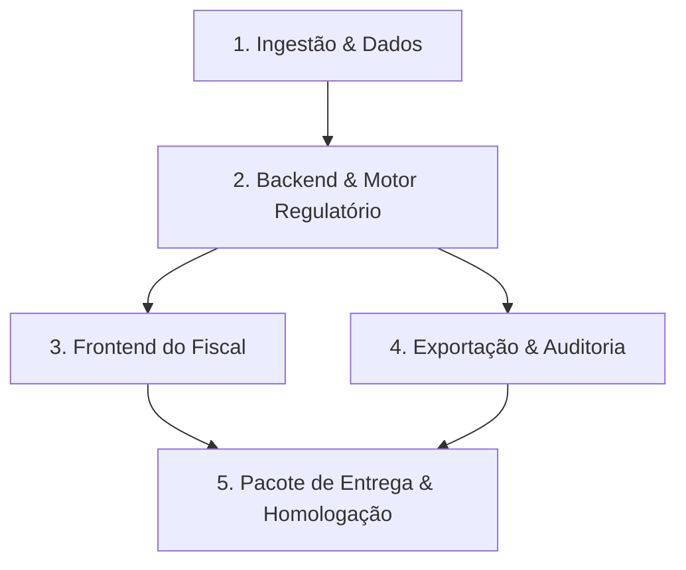

# RELATÓRIO TÉCNICO E DE CONFORMIDADE — CRQ-V-IA

**Processo:** Pregão Eletrônico nº 0005/2026 — Processo Administrativo CRQ-V nº 1729/2026  
**Órgão Licitante:** Conselho Regional de Química da 5ª Região (CRQ-V — Rio Grande do Sul)  
**Objeto:** Contratação de software especializado para prospecção de empresas com potencial de atuação na área da Química no Estado do Rio Grande do Sul, com disponibilização de no mínimo 02 (dois) acessos simultâneos, pelo período de 12 meses (CATSER 27502).  
**Data da Disputa:** 24 de setembro de 2026 às 10h01 (Portal de Compras Banrisul — `www.pregaobanrisul.com.br`)  
**Critério de Julgamento:** Menor Preço Global  
**Regime:** Exclusivo para ME/EPP (Lei Complementar nº 123/2006)  

---

## 1. Sumário Executivo e Diagnóstico Atual

A análise confrontou a base de código clonada em `D:\DEV\CRQ-V-IA` com a documentação oficial da contratação contida em `D:\DEV\doc-CRQ-V-IA`.

### Situação Geral do Repositório
* **Documentação Arquitetural e Especificações:** **100% estruturada no papel.** O repositório conta com 18 especificações detalhadas (`SPEC-0000` a `SPEC-0017`), modelo de dados, matriz de aderência preliminar e checklist de habilitação.
* **Implementação de Código (Software Real):** **0% implementado.**
  * `apps/api`: Contém apenas um `README.md` vazio (sem código FastAPI, SQLAlchemy, rotas ou autenticação).
  * `apps/web`: Contém apenas um `README.md` vazio (sem aplicação Next.js, telas, componentes ou formulários).
  * `services/ingest`: Contém apenas um `README.md` vazio (sem pipelines de ETL, scripts de carga da RFB ou classificação CNAE).
  * `infra`: Apenas um `docker-compose.yml` embrionário com PostgreSQL/PostGIS.

---

## 2. Análise dos Documentos do Processo (`D:\DEV\doc-CRQ-V-IA`)

### 2.1. Termo de Referência (TR — Arquivo `898948.pdf`)
Documento regulador com as obrigações da contratada e especificações do software:
* **Acessos Simultâneos (Itens 1.1, 1.2.3.4, 4.2.4):** Mínimo obrigatório de **02 (dois) acessos simultâneos**.
* **Escopo Geográfico (Item 4.2.1):** Prospecção focada estritamente em empresas com atuação no **Estado do Rio Grande do Sul**.
* **Filtros e Mecanismos de Pesquisa (Item 4.2.2):**
  * Setor de atuação (CNAE principal e secundários, divisões e grupos).
  * Região geográfica (Municípios do RS, microrregiões, bairros, CEP).
  * Porte empresarial (ME, EPP, Demais, faixas de Capital Social).
  * Outros parâmetros de fiscalização (data de abertura, situação cadastral, etc.).
* **Verificação Cadastral de CNPJ (Item 4.2.3):** Consulta da situação cadastral perante a Receita Federal do Brasil (ativa, baixada, inapta, suspensa).
* **Conformidade LGPD (Item 4.2.6):** Aderência estrita à Lei nº 13.709/2018 (minimização de dados, sem raspagem de dados pessoais sensíveis ou desnecessários).
* **Formato Eletrônico e Exportação (Item 4.3.2):** Disponibilização de listas de empresas e relatórios em formato eletrônico (redução de consumo de papel, exportação de roteiros para fiscais).
* **Assistência Técnica e Suporte (Item 4.5):** Suporte durante toda a vigência (12 meses) para dúvidas operacionais, falhas ou restabelecimento do serviço com canal formal.
* **Modelo de Entrega (Item 4.11):** Envio das credenciais de acesso, orientações e manual aos usuários indicados pelo CRQ-V imediatamente após a formalização do contrato.
* **Valor Estimado de Referência (Item 9):**
  * **Valor Global Estimado:** **R$ 4.800,00** para 12 meses.
  * **Valor Mensal Estimado:** **R$ 400,00/mês**.

### 2.2. Estudo Técnico Preliminar (ETP — Arquivo `898951.pdf`)
* **Problema Administrativo:** Atualmente a prospecção de empresas para fiscalização é feita de forma dispersa e manual, gerando morosidade no planejamento das ações do Departamento de Fiscalização e Autuação.
* **Fundamentação Técnica:** O sistema precisa reunir informações da RFB e cruzá-las com a área química para subsidiar o aumento previsto de agentes fiscais em campo.
* **Pesquisa de Mercado Inicial:** Registrou cotações da Econodata (R$ 20.950,00) e EmpresAqui (R$ 3.510,00), com média preliminar de R$ 12.230,00 (posteriormente ajustada no TR final para R$ 4.800,00).
* **Riscos Identificados:**
  1. Dificuldade de uso pelos servidores (mitigação: treinamento/manual prático).
  2. Indisponibilidade do sistema (mitigação: monitoramento e suporte técnico).

### 2.3. Edital do Pregão (Arquivo `898947.pdf`)
* **Modalidade:** Menor Preço Global, disputa aberta via Banrisul Compras.
* **Qualificação Técnica (Item 15.2.6):** Atestado(s) de capacidade técnica comprovando aptidão para fornecimento de software similar de complexidade equivalente ou superior.
* **Qualificação Econômico-Financeira (Item 15.2.3):** Balanço patrimonial dos 2 últimos exercícios sociais (ou do exercício corrente para novas empresas), índices contábeis (LG, SG, LC >= 1) ou comprovação de Patrimônio Líquido de 10% do valor da proposta.

### 2.4. Proposta Comercial e Contrato (Arquivos `898949.pdf` e `898950.pdf`)
* Item único: Software de prospecção, código CATSER 27502, 12 meses de vigência, pagamento mensal pós-faturado.

---

## 3. Matriz de Lacunas (Gap Analysis: Requisitos x Situação do Código)

| ID TR | Exigência do Termo de Referência | Status no Repositório | O que FALTA Desenvolver |
|---|---|---|---|
| **TR-001** | Prospecção de empresas com potencial químico no RS | Apenas especificado | ETL de CNPJs abertos da RFB filtrados por UF='RS', carga de CNAEs e tabela de regras da Resolução CFQ nº 339/2025. |
| **TR-002** | Filtros por setor de atuação (CNAE) | Apenas especificado | Endpoints de busca e seletores frontend para CNAE primário/secundário, divisão e grupo. |
| **TR-003** | Filtros por região geográfica no RS | Apenas especificado | Base de municípios do RS com integração PostGIS ou filtro textual/código IBGE no backend e interface. |
| **TR-004** | Filtros por porte empresarial | Apenas especificado | Filtragem por código RFB (ME, EPP, Demais) e faixas de capital social. |
| **TR-005** | Critérios compatíveis com fiscalização | Apenas especificado | Mecanismo de ranqueamento (Score) com justificativa regulatória legível por fiscais (explicabilidade). |
| **TR-006** | Consulta da situação cadastral do CNPJ | Apenas especificado | Adaptador de consulta online em tempo real (ex.: BrasilAPI / ReceitaWS / Conecta gov.br) para dados atualizados. |
| **TR-007** | Mínimo de 02 acessos simultâneos | Apenas especificado | Sistema de autenticação (JWT) sem restrição impeditiva para 2 ou mais usuários navegando juntos. |
| **TR-008** | Conformidade com a LGPD | Apenas especificado | Política de minimização no banco (não carregar dados pessoais desnecessários de sócios) e logs de auditoria. |
| **TR-009** | Plataforma 100% em nuvem (sem infra local) | Docker básico | Backend e frontend em containers prontos para publicação em VPS de baixo custo ($5 a $10/mês). |
| **TR-010** | Exportação eletrônica de listas | Apenas especificado | Módulo para salvar listas/roteiros de fiscalização e gerar downloads em CSV, Excel (XLSX) e relatórios. |
| **TR-011** | Suporte e manual de orientações | Apenas especificado | Manual do Usuário em PDF/HTML e definição do canal formal de chamados para os fiscais. |

---

## 4. Plano de Implementação Técnica Necessária

Para atingir conformidade operacional e técnica completa, o desenvolvimento deve seguir 5 blocos prioritários:

### Bloco 1: Base de Dados e Pipeline de Ingestão (`services/ingest`)
1. **Script de Download e Carga da RFB (RS):**
   - Baixar arquivos públicos de Empresas, Estabelecimentos e CNAEs da Receita Federal.
   - Filtrar somente o estado do RS (`UF == 'RS'`), mantendo a base enxuta e performática no PostgreSQL.
2. **Classificador Regulatório CFQ 339/2025:**
   - Popular a tabela de CNAEs químicos dividida em faixas de relevância:
     - **Alta:** Fabricação de produtos químicos, tintas, solventes, fertilizantes, cosméticos, saneantes, petroquímica.
     - **Média:** Tratamento de efluentes, galvanoplastia, indústrias farmacêuticas, alimentos com aditivos.
     - **Baixa/Apoio:** Comércio atacadista especializado em químicos e defensivos agrícolas.
3. **Adaptador de CNPJ em Tempo Real:**
   - Integração com provedor público/gratuito (ex.: BrasilAPI / ReceitaWS) com cache para atualizações pontuais sob demanda.

### Bloco 2: Backend API (`apps/api`)
1. **Stack:** FastAPI + SQLAlchemy 2 + Pydantic v2 + PostgreSQL/PostGIS.
2. **Módulos a codificar:**
   - `auth`: Autenticação e autorização para os fiscais do CRQ-V (garantindo o suporte aos 2 acessos simultâneos).
   - `prospects`: Endpoints de busca paginada com múltiplos filtros combinados (CNAE, Cidade do RS, Situação, Porte, Faixa de Capital).
   - `companies`: Detalhe cadastral do estabelecimento com histórico e justificativa do enquadramento na Química.
   - `lists`: Criação e gestão de roteiros de fiscalização por agente fiscal.
   - `exports`: Geração de arquivos CSV e planilhas XLSX para trabalho de campo.
   - `audit`: Log de acessos e consultas para total rastreabilidade.

### Bloco 3: Frontend Web (`apps/web`)
1. **Stack:** Next.js (App Router) + TailwindCSS + Lucide Icons.
2. **Telas essenciais:**
   - **Login:** Autenticação limpa com tratamento de sessões simultâneas.
   - **Painel de Prospecção:** Busca avançada com filtros laterais (CNAE, Municípios do RS, Porte, Situação Cadastral).
   - **Ficha da Empresa:** Dados completos da RFB, localização e card explicativo: *"Por que esta empresa tem potencial químico?"*.
   - **Roteiros de Fiscalização:** Organização de empresas selecionadas para inspeção presencial ou notificação.
   - **Exportações:** Download direto das listas filtradas.

### Bloco 4: Infraestrutura e Custo Operacional (`infra`)
* Tendo em vista o valor contratual de **R$ 400,00 mensais**:
  - A solução deve operar em uma **VPS enxuta (2 a 4 vCPU, 4 a 8 GB RAM, ex.: Hetzner, OVH ou DigitalOcean) custando entre R$ 35,00 e R$ 75,00/mês**.
  - Orquestração via Docker Compose com Nginx (SSL Let's Encrypt), PostgreSQL otimizado e os containers de API e Web.

### Bloco 5: Documentação de Entrega Contratual
* **Manual de Operação do Sistema:** Passo a passo ilustrado para os fiscais do CRQ-V (atende ETP item 12.1 e TR item 4.11.2).
* **Guia de Ativação e Onboarding:** Credenciais iniciais e orientações de primeiro acesso.
* **Termo de Acordo de Nível de Serviço (SLA) e Suporte:** Horários de atendimento e canais oficiais de contato (atende TR item 4.5).

---

## 5. Próximos Passos Imediatos

1. Executar o scaffold completo do backend FastAPI em `apps/api`.
2. Executar o scaffold da aplicação Next.js em `apps/web`.
3. Criar os scripts de seed em `services/ingest` com base demonstrativa do RS e tabela CNAE/CFQ 339.
4. Conectar a interface web aos endpoints de prospecção e exportação.
5. Gerar a documentação de entrega (Manual do Usuário e Guia de Credenciais).
